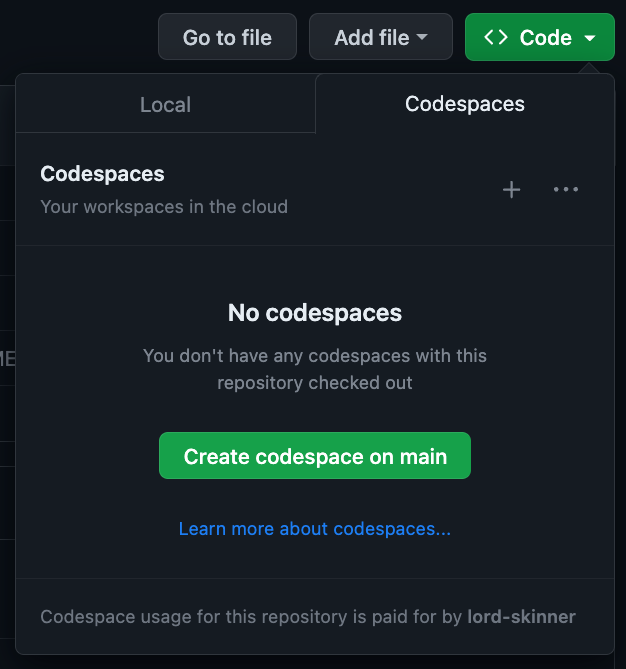

# Developing Data Transformations @ Elastic

## Use dbt Core on Github Codespaces
[On the repo's landing page](https://github.com/elastic/dbt) click the green button `<> Code`, click the Codespaces tab, and then click `Create codespace on main` button. 



This will open the repo in an interactive container accessed by your web browsewr with all the required dependecies already installed.

<br/>

As you connect to the container `_startup.py` will automatically run and ensure you have all the required authentication and environment variables setup. If you don't have them, it will prompt you in the terminal to take action, record the input, and then setup the missing requirements.

You can also connect to Github Codespaces directly from VS Code Desktop if you prefer.

<br/>

### Make sure create a branch before starting to edit.

<br/><br/>


## Setup to Run Locally using Dev Containers

#### Prerequisites: 
- VS Code Installed
- Dev Containers extension installed
- Docker Desktop Installed and running in the background

Go to the `Remote Explorer` Extension, click the + button and select `Open Current Folder in Container` The Remote Explorer Extension will automatically build the entire image, create necessary volumes, and attach VS Code the interactive container. This will take a minute or two, but subsequent builds will be much faster since you've already built the image and have all the dependencies downloaded.

Once the folder is reopened and VS Code is attached (you will know it's ready when you can see the list of files and folders) `_startup.py` will automatically run and ensure you have all the required authentication and environment variables setup. If you don't have them, it will prompt you in the terminal to take action, record the input, and then setup the missing requirements.

Note that the **second** time you open a repo in VS Code with a `.devcontainer` folder, VS Code will recognize it and provide a pop up, 
click the `Reopen Folder in Container` button.

<br/>

### Make sure create a branch before starting to edit.

<br/><br/>

## Special Notes

If you need to update your development schema you can run the following command in the terminal:

```bash
echo export DBT_DEV_DATASET=dbt_your_name_here > ~/.bashrc && source ~/.bashrc
```